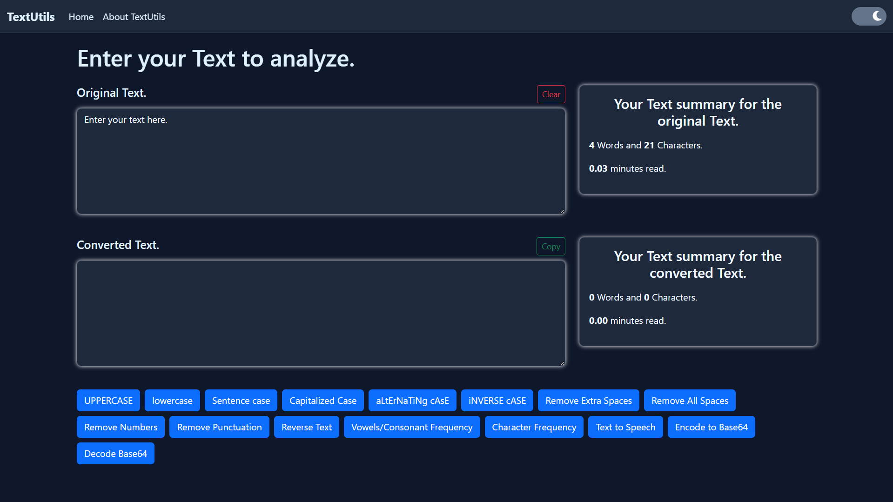
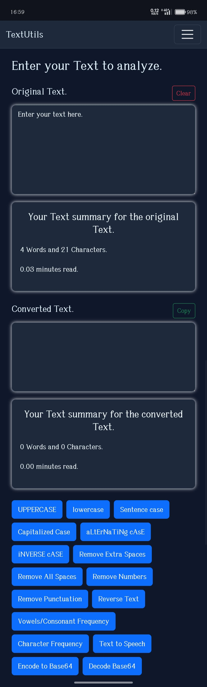
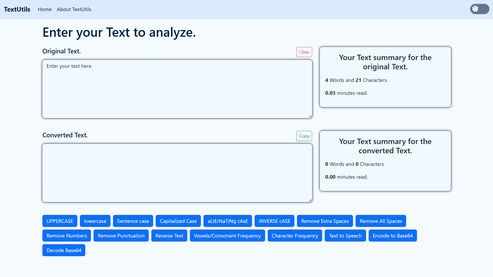

# TextUtils 📝

**TextUtils** is a powerful React-based text utility web application that provides a variety of features to manipulate and analyze text efficiently.

 
 

---

## ✨ Features

- ✅ Convert text to **UPPERCASE** or **lowercase**
- ✅ Convert text to **Sentence case**, **Capitalized Case**, **aLtErNaTiNg cAsE**, **iNVERSE cASE**
- ✅ **Remove extra spaces** or **all spaces**
- ✅ **Remove numbers** or **punctuation**
- ✅ **Reverse** the text
- ✅ **Base64 encode** / decode
- ✅ **Text-to-speech**
- ✅ **Vowel/Consonant character count**
- ✅ **Character frequency analyzer**
- ✅ Word and character summary for both original and converted text
- ✅ Dark/Light mode toggle
- ✅ Copy and Clear functionality

---

## 📦 Technologies Used

- React.js
- Bootstrap 5
- HTML / CSS
- JavaScript

---

## 🚀 Getting Started

### 1. Clone the repository

```bash
git clone https://github.com/your-username/TextUtils.git
cd TextUtils
```

### 2. Install dependencies

```bash
npm install
```

### 3. Run the app locally

```bash
npm start
```

Your app will run at `http://localhost:3000`

---

## 🔗 Deployment on GitHub Pages

To deploy this app on GitHub Pages:

1. Install the GitHub Pages package:

```bash
npm install gh-pages --save-dev
```

2. Add these lines to your `package.json`:

```json
"homepage": "https://your-username.github.io/TextUtils",
"scripts": {
  "predeploy": "npm run build",
  "deploy": "gh-pages -d build"
}
```

3. Push to GitHub and deploy:

```bash
npm run deploy
```

---

## 📂 Folder Structure

```
TextUtils/
│
├── public/
│   └── index.html
│
├── src/
│   ├── Components/
│   │   ├── Navbar.js
│   │   ├── TextArea.js
│   │   └── Alert.js
│   ├── App.js
│   ├── App.css
│   └── index.js
│
├── README.md
└── package.json
```

---

## 📄 License

This project is licensed under the **MIT License** – feel free to use and modify!

---

## 🧑‍🎓 Author

Made with ❤️ by [Shivam S. Ramoliya](https://github.com/Shivam-Ramoliya)

---

> _TextUtils: Simplify and Supercharge Your Text Editing!_
